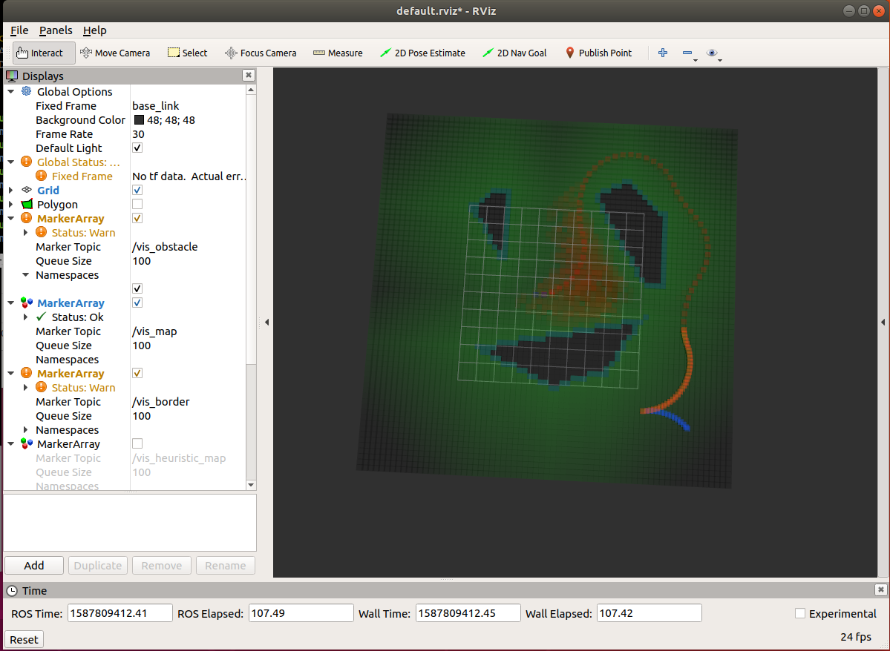

This Project is an implementation of "Path Planning for Autonomous Vehicles in Unknown Semi-structured Environments", Hybrid A* together with Reeds Shepp Path for open space trajectory searching. Some part of code refers to Baidu Apollo, including RS path param calculation.

Results:

The trajectory points contains two parts. The first part is generated by grid search using Hybrid A* from the start point, while the second part is generated by RS path leading to the destination.

#How to use
1. Clone the project to your_workspace/src.
2. Come back to your_workspace and catkin_make
3. source devel/setup.sh
4. roslaunch planner search.launch

parameters can be set in the launch file.

整个算法写的较为简洁清晰.
采用栅格图进行障碍物检测,并进行到目标点距离计算.
采用node_3D点进行轨迹搜索. 节点的总代价是pathcost+heuristiccost

初始起点的路径代价为0
初始终点的目标代价为0

GenerateObstacleDistanceMap 没太懂
NextNodeGenerator

border_available_ 边界点的构成要素:自节点是可达的,而下一个相邻节点是不可达的.
border_unavailable_ 障碍物的边缘不可达的栅格点集合.
如何形成障碍物多边形 获取障碍物轮廓

double headingdiff =dis / WHEEL_BASE * std::tan(steer)

用栅格图来表征整个环境,

hybrid a主要流程:
障碍物的表达,
代价的计算
主处理

均采用reeds_shepp曲线进行探索,
